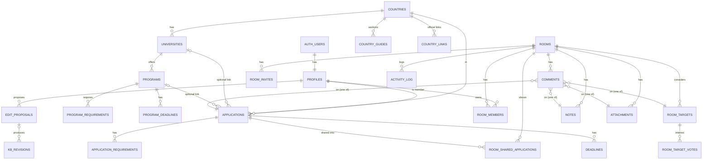

# ApplyHub: data model and page map

This document describes the data model, the security model and the page map.
It was written before the code, and it is kept in sync with the migrations in
`supabase/migrations`.

## 1. Architecture

```
┌──────────────────────────────┐        HTTPS (anon key + user JWT)        ┌─────────────────────────────┐
│ GitHub Pages (static files)  │  ───────────────────────────────────────▶ │ Supabase                    │
│ Vite + React SPA             │   /auth/v1      Supabase Auth (GoTrue)    │  Postgres + RLS             │
│ https://abtin81badie.github.io│   /rest/v1      PostgREST (tables, RPC)   │  Auth, Storage, Realtime    │
│                              │   /storage/v1   private bucket room-files │                             │
│                              │   /realtime/v1  activity feed             │                             │
└──────────────────────────────┘                                           └─────────────────────────────┘
```

- The browser only has the **anon key**. Every permission is decided in
  Postgres by Row Level Security (RLS), column-level `GRANT`s and checks inside
  `SECURITY DEFINER` functions. Client-side checks only hide buttons.
- Helper functions that bypass RLS (`SECURITY DEFINER`) live in the `private`
  schema, which PostgREST does not expose. The only functions exposed as RPC
  are the ones listed in section 5.
- Deep links (`/rooms/…`) survive a refresh through a generated `404.html` that
  redirects to `index.html` and restores the URL.

## 2. Enums

| Enum | Values |
| --- | --- |
| `user_role` | `user`, `admin` |
| `degree_level` | `bachelor`, `master`, `phd`, `other` |
| `intake_term` | `fall`, `winter`, `spring`, `summer` |
| `application_status` | `researching` → `planning` → `preparing` → `submitted` → `interview` → `admitted` / `rejected` / `waitlisted` / `withdrawn` |
| `application_visibility` | `private`, `shared` |
| `requirement_kind` | `language_test`, `gpa`, `cv`, `sop`, `lor`, `portfolio`, `gre`, `gmat`, `pre_evaluation`, `transcript`, `degree_certificate`, `passport`, `research_proposal`, `writing_sample`, `interview`, `application_form`, `fee_payment`, `other` |
| `tuition_period` | `year`, `semester`, `total` |
| `applicant_group` | `all`, `domestic`, `eu_eea`, `international` |
| `room_role` | `owner`, `editor`, `viewer` |
| `target_interest` | `interested`, `applying`, `not_interested` |
| `note_kind` | `note`, `link` |
| `guide_section` | `overview`, `application_process`, `timeline`, `required_documents`, `language_requirements`, `tuition_scholarships`, `visa_process`, `cost_of_living` |
| `kb_entity` | `country_guide`, `country_link`, `university`, `program`, `program_requirement`, `program_deadline` |
| `proposal_action` | `create`, `update`, `delete` |
| `proposal_status` | `pending`, `approved`, `rejected`, `withdrawn` |

All timestamps are `timestamptz` (stored in UTC). Calendar dates without a
time (`result_date`, `submitted_at`) are `date`. Every table has `created_at`,
and every mutable table has `updated_at`, which a trigger maintains.

## 3. Tables

### 3.1 Accounts

**`profiles`**: one row per `auth.users` row, created by a trigger on sign-up.

| Column | Type | Notes |
| --- | --- | --- |
| `id` | uuid PK | FK → `auth.users.id`, cascade delete |
| `display_name` | text | 1–80 chars |
| `avatar_url` | text | `https://` only (usually from Google or GitHub) |
| `field_of_study` | text | |
| `target_degree` | `degree_level` | |
| `target_intake_term`, `target_intake_year` | `intake_term`, smallint | for example Fall 2027 |
| `target_countries` | text[] | ISO codes |
| `role` | `user_role` | default `user`. Clients cannot update this column (column-level grant). Admins change it through `set_user_role()`. |
| `onboarded_at` | timestamptz | set when the onboarding form is completed |

RLS: you can read your own profile, the profiles of people you share a room
with, and every profile if you are an admin. You can update only your own
row, and only the non-role columns. Other screens that need a name (revision
history) call `get_profile_cards()`, which returns only name and avatar.

### 3.2 Knowledge base (public read, admin write)

Every factual row has **`source_url`** and **`last_verified_at`**, and a
**`is_placeholder`** flag. A `CHECK` constraint enforces
`is_placeholder OR (source_url IS NOT NULL AND last_verified_at IS NOT NULL)`,
so real facts cannot be stored without a source. The UI shows the source link,
the verification date, and a warning badge when `last_verified_at` is older
than 6 months.

| Table | Key columns |
| --- | --- |
| **`countries`** | `code` (PK, ISO-3166 alpha-2), `name_en`, `name_fa`, `flag_emoji`, `region`, `currency_code`, `is_published` |
| **`country_guides`** | one row per guide section: `country_code` FK, `locale` (`fa`/`en`), `section` (`guide_section`), `body_md`, `source_url`, `last_verified_at`, `is_placeholder`. Unique (`country_code`, `locale`, `section`). |
| **`country_links`** | official links: `country_code` FK, `label_en`, `label_fa`, `url`, `category`, `last_verified_at`, `is_placeholder`, `sort_order` |
| **`universities`** | `country_code` FK, `name_en`, `name_fa`, `city`, `website_url`, `institution_type`, `description_md`, `source_url`, `last_verified_at`, `is_placeholder`, `is_published` |
| **`programs`** | `university_id` FK, `name_en`, `name_fa`, `degree_level`, `field`, `languages` text[], `duration_months`, `tuition_amount_min/max`, `tuition_currency`, `tuition_period`, `application_fee_amount/currency`, `website_url`, `description_md`, `source_url`, `last_verified_at`, `is_placeholder`, `is_published` |
| **`program_requirements`** | `program_id` FK, `kind` (`requirement_kind`), `description`, `is_mandatory`, `source_url`, `last_verified_at`, `is_placeholder`, `sort_order` |
| **`program_deadlines`** | `program_id` FK, `intake_term`, `intake_year`, `round_label`, `applicant_group`, `opens_at`, `deadline_at`, `notes`, `source_url`, `last_verified_at`, `is_placeholder` |

View **`university_directory`** (`security_invoker`): each university plus
aggregates over its published programs (fields, languages, degree levels,
min/max tuition, program count). The country page filters on it by city,
field, language of instruction and tuition range.

RLS: anyone, including anonymous visitors, can read published rows. Only admins
can write directly. Everyone else goes through `edit_proposals`.

### 3.3 Moderation and history

**`edit_proposals`**: `entity_type` (`kb_entity`), `entity_id` (null for
create), `action`, `payload` jsonb (proposed column values), `base_snapshot`
jsonb (the row as the proposer saw it, used for the diff), `message` (why and
where the information comes from), `status`, `proposed_by`, `reviewed_by`,
`reviewed_at`, `review_note`, `result_entity_id`.

- Logged-in users insert proposals with `status = 'pending'`. There is a limit
  of 30 pending proposals per user.
- Proposers can read their own proposals and withdraw them while pending.
  Admins can read all of them.
- `approve_edit_proposal()` (admin only) applies the payload to the target
  table using a per-table column whitelist, then marks the proposal approved.
  `reject_edit_proposal()` records the review note.

**`kb_revisions`**: append-only history written by triggers on every
knowledge-base table: `entity_type`, `entity_id`, `action`, `old_data`,
`new_data`, `proposal_id`, `changed_by`, `changed_at`. It is public to read,
and the `/history/...` pages show it as a diff.

### 3.4 Personal tracker (owner only)

**`applications`**

| Column | Notes |
| --- | --- |
| `user_id` | owner, defaults to `auth.uid()` |
| `country_code` | FK → countries (nullable) |
| `university_id`, `program_id` | optional links to the knowledge base |
| `university_name`, `program_name` | required free text (pre-filled from the knowledge base) |
| `degree_level`, `intake_term`, `intake_year` | |
| `portal_url` | |
| `status` | `application_status` |
| `submitted_at` | date |
| `application_fee_amount/currency`, `tuition_amount/currency/period` | |
| `funding_info` | scholarship and funding |
| `result_date`, `decision_notes` | outcome |
| `notes` | private free-form notes, **never shared with rooms** |
| `visibility` | `private` or `shared` (master switch; switching to private deletes all room shares) |

**`application_requirements`**: `application_id` FK (cascade), `kind`,
`label`, `is_done`, `notes`, `sort_order`.

**`deadlines`**: application deadlines, one or more rounds: `application_id`
FK (cascade), `label` (for example "Round 1"), `due_at`, `is_done`, `notes`.

RLS: only the owner can read or write these three tables. Room members never
query them directly. They see shared applications through
`get_room_applications()` and `get_shared_application()`, which return a fixed
set of safe columns (no private `notes`) and only for applications that are
shared into a room the caller belongs to.

### 3.5 Rooms (members only)

| Table | Columns | Read | Write |
| --- | --- | --- | --- |
| **`rooms`** | `name`, `description`, `country_code`, `intake_term`, `intake_year`, `created_by` | members | create through `create_room()`. Owners update and delete. |
| **`room_members`** | PK (`room_id`, `user_id`), `role`, `joined_at` | members | join only through `join_room(code)`. Owners change roles and remove members. Members can leave. A room always keeps at least one owner (trigger). |
| **`room_invites`** | `code` (unique, random, 12 chars), `role` (`editor`/`viewer`), `expires_at`, `max_uses`, `use_count`, `revoked_at`, `created_by` | owners | owners only. Rate limit: 10 per user per hour and 50 per room per day (trigger). `regenerate_room_invite()` revokes the old codes. |
| **`room_shared_applications`** | PK (`room_id`, `application_id`), `shared_by`, `shared_at` | members | the application's owner, who must be an editor or owner of the room. The owner, or the room owner, can remove it. |
| **`room_targets`** | the shared target list: `university_id`, `program_id` (optional knowledge-base links), `title`, `country_code`, `url`, `notes`, `created_by` | members | editors and owners. The creator or an owner can delete. |
| **`room_target_votes`** | PK (`target_id`, `user_id`), `interest` (`target_interest`) | members | editors and owners, own vote only (through `set_target_interest()`) |
| **`notes`** | `kind` (`note`/`link`), `title`, `body_md`, `url`, `is_pinned`, `created_by`, `updated_by` | members | editors and owners create and edit. The creator or an owner deletes. |
| **`comments`** | exactly one of `application_id`, `note_id`, `target_id`, `attachment_id`, plus `parent_id` for replies, `body`, `author_id` | members | editors and owners create. Authors edit. The author or an owner deletes. A trigger checks that the target belongs to the room. |
| **`attachments`** | `storage_path` (`<room_id>/<uuid>-<file>`), `file_name`, `mime_type`, `size_bytes`, `description`, `uploaded_by` | members | editors and owners upload. The uploader or an owner deletes. |
| **`activity_log`** | `room_id`, `actor_id`, `action`, `entity_type`, `entity_id`, `metadata` jsonb | members | triggers only. There are no client write grants. |

Removing a member, or a member leaving, also removes that member's shared
applications from the room. Unsharing an application removes its earlier
activity entries in that room.

### 3.6 Storage and Realtime

- Bucket **`room-files`**: private, 10 MB limit, restricted MIME types. The
  object path starts with the room id. `storage.objects` policies allow
  reading for room members, uploading for editors and owners, and deleting for
  the uploader or a room owner. Files are served through signed URLs that
  expire after 60 seconds. The upload dialog warns users not to upload passport
  scans, national ID numbers or bank details.
- **Realtime**: `activity_log` is in the `supabase_realtime` publication. The
  room page subscribes to `INSERT` events filtered by `room_id`. Realtime
  checks RLS for each subscriber, and the client refreshes the affected
  queries.

### 3.7 Entity-relationship diagram



## 4. Security model

1. **RLS is enabled on every table.** Policies target `authenticated` (and
   `anon` only for published knowledge-base rows).
2. **Column-level grants** make ownership and foreign-key columns immutable
   (`user_id`, `room_id`, `created_by`, …) and block `profiles.role`
   escalation, because the `UPDATE` privilege is granted only on editable
   columns.
3. **Membership helpers** (`private.is_room_member`, `private.can_edit_room`,
   `private.is_room_owner`, `private.is_admin`) are `SECURITY DEFINER`,
   `STABLE` and pinned to `search_path = ''`, which avoids policy recursion.
4. **Rate limits** are implemented in triggers: invite creation, room creation
   (20 per day) and pending proposals (30).
5. **Markdown** is rendered with `react-markdown`, which does not render raw
   HTML, plus `rehype-sanitize`. Only `http(s)` and `mailto` links are
   allowed, and links open with `rel="noopener noreferrer nofollow"`.
6. **Invite codes** are 12 random characters from a 32-character alphabet
   (60 bits). Joining goes through `join_room()`, which checks expiry,
   revocation and `max_uses`.
7. There is no service-role key in the frontend, and the frontend has no admin
   API.

## 5. RPC functions (`public` schema)

| Function | Purpose |
| --- | --- |
| `create_room(name, description, country_code, intake_term, intake_year)` | creates a room and its owner membership |
| `regenerate_room_invite(room_id, role, expires_at, max_uses)` | owner: revokes active codes and returns a new invite |
| `get_invite_preview(code)` | room name and description, role and validity, shown before joining |
| `join_room(code)` | validates the code and inserts the membership |
| `leave_room(room_id)` | leaves the room (the last owner cannot leave) |
| `set_application_sharing(application_id, room_ids[])` | sets visibility and room shares atomically |
| `get_room_applications(room_id)` | shared-application board (safe columns only) |
| `get_shared_application(room_id, application_id)` | detail: deadlines and checklist |
| `set_target_interest(target_id, interest)` | sets or clears the caller's interest marker |
| `add_to_tracker(university_id, program_id)` | one click: copies knowledge-base data, requirements and upcoming deadlines into a new application |
| `approve_edit_proposal(id, note)` / `reject_edit_proposal(id, note)` | admin moderation |
| `get_profile_cards(ids[])` | display name and avatar only |
| `set_user_role(user_id, role)` | admin only |

## 6. Page map

| Path | Access | Purpose |
| --- | --- | --- |
| `/` | public | Landing page. Signed-in users see links to their dashboard. |
| `/login` | public | Sign in with a magic link, a 6-digit email code, a password, Google or GitHub |
| `/signup` | public | Create an account with email and password, a magic link, Google or GitHub |
| `/forgot-password` | public | Request a password reset email |
| `/auth/callback` | public | Completes the OAuth or email link, then continues to `next`, `/onboarding` or `/dashboard` |
| `/auth/reset-password` | recovery session | Set a new password |
| `/onboarding` | signed in | First-run profile (name, field, target degree, intake, countries) |
| `/profile` | signed in | Profile and preferences (language, calendar, theme) |
| `/dashboard` | signed in | Counts per status, deadlines in the next 30 days, acceptance rate, recent room activity |
| `/applications` | signed in | Tracker with `?view=board` (Kanban), `table` (sort and filter) or `calendar` (month grid and timeline) |
| `/applications/new`, `/applications/:id/edit` | owner | Application form |
| `/applications/:id` | owner | Detail: requirements checklist, deadlines, result, notes, sharing |
| `/rooms` | signed in | My rooms, create a room, join with a code |
| `/rooms/:roomId` | members | Room overview. Tabs: `applications`, `targets`, `notes` (and `notes/:noteId`), `files`, `activity`, `members` (owners also manage invites) and `settings` |
| `/join/:code` | public preview, join when signed in | Invite landing page |
| `/countries` | public | Country list |
| `/countries/:code` | public | Guide sections with sources and badges, official links, university directory with filters |
| `/universities/:id` | public | University, its programs, "Add to tracker", "Propose edit" |
| `/programs/:id` | public | Program: requirements, deadlines, fees and tuition with sources |
| `/history/:entityType/:entityId` | public | Revision history with diffs |
| `/contribute` | signed in | My proposals and their status, plus new proposals (`/contribute/new?…`) |
| `/admin/moderation` | admin | Moderation queue with diffs, approve and reject |
| `/data` | signed in | Export to CSV or JSON (personal and room), import from CSV |
| `*` | public | Not found |

## 7. Build phases

1. **Auth**: foundation migration, profiles, countries, and all the auth pages.
2. **Tracker**: applications, requirements, deadlines, the Kanban, table,
   calendar and dashboard views, and the detail and edit pages.
3. **Rooms**: rooms, membership and invites, sharing, targets and votes,
   notes, comments, files, and the activity feed with Realtime.
4. **Knowledge base**: guides, links, universities, programs, the placeholder
   seed, source and freshness badges, filters, and add-to-tracker.
5. **Moderation**: proposals, the queue, approve and reject, and revision
   history.
6. **Data**: CSV/JSON export and CSV import, then CI and the deploy workflow.
